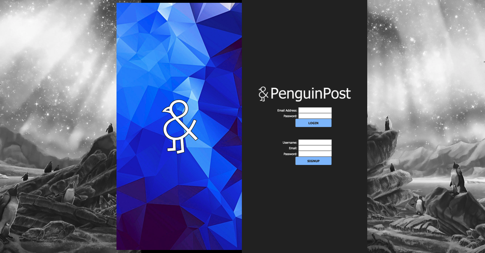
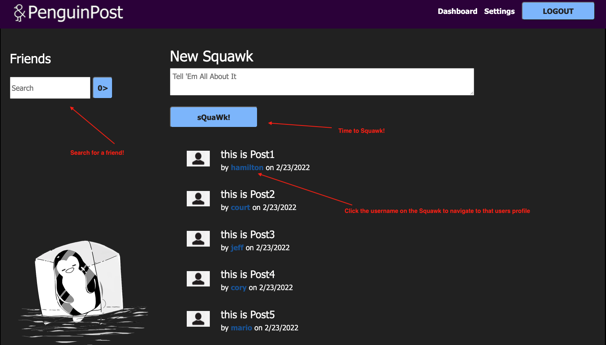
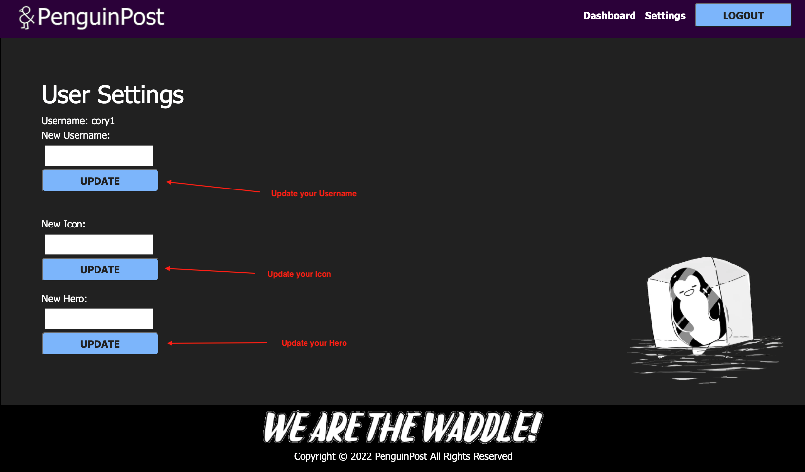

# Penguin Post

This website showcases skills learned during weeks 7-14 of The Coding Bootcamp at UT Austin. 

The Penguin Post is a social media website that allows a user to 'Squawk' (share up to 281 characters of information to your friends), favorite Squawks and grow your group of friends to stay engaged with your community.
  

## How Penguin Post is Used
When you navigate to our home page you will be able to view a list of recent Squawks in decending order from newest to oldest. From there you can navigate to the login page (by clicking login at the top right corner of the window) to be directed to the login and sign up form.

### Home

  

 When prompted, enter a username, a valid email address and a password then click sign up. 
  

### Login 

  
You will then be directed to the user dashboard page. From here you can search for friends to add to your friends list or you can create your first Squawk! Click the Username on the Squawk to navigate to that users profile.
  

### Dashboard 

  

### Profile 

  
Don't forget to visit the settings page if you want to update your hero image and or user icon.
  

### Settings

  
## Languages/Technologies Used
* HTML
* CSS
* Bootstrap
* Javascript
* Node.js
* Handlebars.js
* bcrypt
* dotenv
* express
* express-session
* nodemon
* mysql2
* sequelize

  
## Contributers
Cheyne Etie (Chewbakkah)
https://github.com/Chewbakkah

Cory Davis (cmd0160)
https://github.com/cmd0160

Court Evans (court65)
https://github.com/court65

Hamilton Dowdy  (hamiltondowdy)
https://github.com/hamiltondowdy

Jeffrey Grauzer  (JeffreyGrauzer)
https://github.com/JeffreyGrauzer

Mario Gallardo (mgall13)
https://github.com/mgall13

  
### GitHub Repo
https://github.com/Chewbakkah/penguin-post

### Live Link
https://ravenclaw-penguinpost.herokuapp.com/

### Link to Presentation Google Slide Doc
https://docs.google.com/presentation/d/1fcYAnFWSZSsiq-L0slrYVUbey3ZJAJ6UgMAXgDuAWz8/edit?usp=sharing

